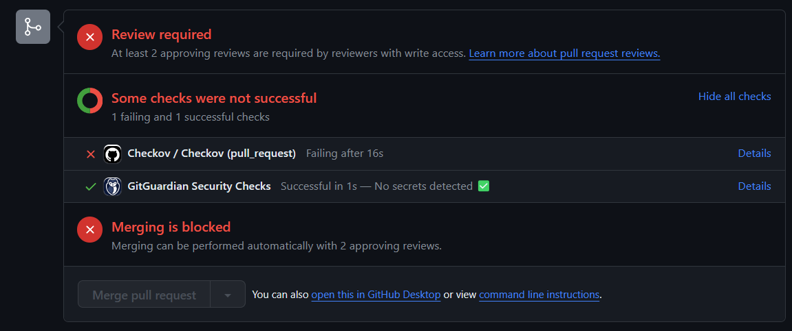

# List of bugs/errors encountered and its solution/fixes

All notable bugs/errors to this project will be documented in this file.

---

## Error: Checkov analysis check failing upon Pull request from the `features` to `development` branches

## Solution: Resolve the error with known fix, or specify a "Suppressing individual checks" comment within the Terraform configurations for known issues

1. [On 16 Mar 2024 checkov two issues and resolved](./screenshots/16032024-checkov-2_issues.png)

2. [On 16 Mar 2024 checkov dynamoDB autoscaling issue and resolved](./screenshots/16032024-checkov-autoScaling_issue.png)

3. [On 21 Mar 2024 checkov s3 bucket versioning issue and resouce block added](./screenshots/21032024-checkov-s3_bucket_versioning_issue.png)

4. [On 17 Mar 2024 checkov ensure access control lists for S3 buckets are disabled](./screenshots/17032024-checkov-s3_bucket_ACL_issue.png)

5. [On 21 Mar 2024 checkov ensure s3 bucket access logging enable](./screenshots/21032024-checkov-s3_bucket_Access-logging_issue.png)

6. [On 21 Mar 2024 checkov ensure s3 bucket lifecycle configuration block added](./screenshots/21032024-checkov-s3_bucket_lifecycle-configuration_issue.png)

7. [On 21 Mar 2024 checkov ensure abort_incomplete_multipart_up rule added](./screenshots/21032024-checkov-s3_bucket_lifecycle-configuration_set-abort_issue.png)

8. [On 19 Mar 2024 checkov ensure logging_config block added](/screenshots/19032024-checkov-cf-distribution-logging_issue.png)

9. [On 21 Mar 2024 checkov ensure s3 bucket encrpted with KMS block added](./screenshots/21032024-checkov-s3_bucket_encrypted_with_KMS_issue.png)

10. [On 21 Mar 2024 checkov ensure KMS key policy added](./screenshots/21032024-checkov-define_KMS_key_policy_issue.png)

11. [On 21 Mar 2024 checkov ensure KMS key rotation added](./screenshots/21032024-checkov-rotation_KMS_key_policy_issue.png)

n. Edit or remove as necessary

## Bug or Error: Add notable bug/error here

## Solution or Fix: Add solution/fix here

