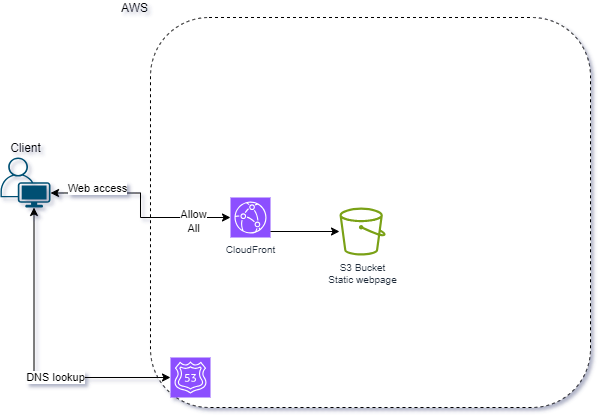
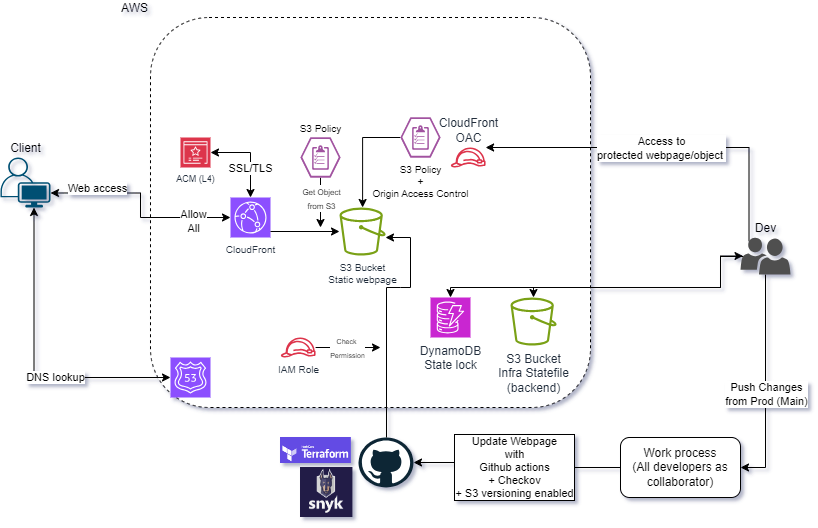
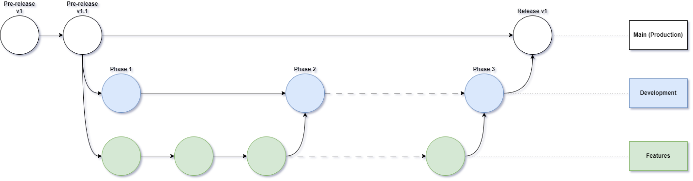
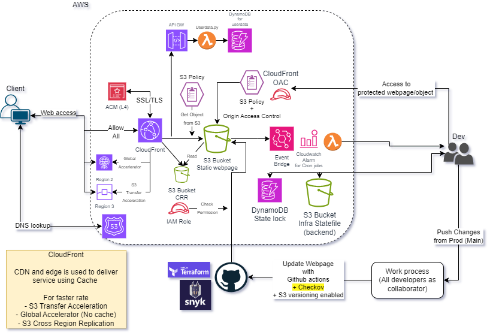

# DevSecOps

This README.md details the implementation of a DevSecOps approach for the project. It outlines the methodologies, tools, and outcomes achieved by integrating development, security, and operations processes throughout the software development lifecycle (SDLC).
## NTU_SCTP_CE4_Capstone Project, Grp 3 (Quintet) 
### _Period: Sep 2023 - Mar 2024_
### _Author(s):_
- Ang Kok Beng
- Joseph Ong
- Lim Wei Jie
- Muhammad Rudyn
- Sagar Ingale

## _Introduction_ _ SAGAR

DevSecOps is the seamless integration of security with two other disciplines: devlopment and operations. Main purpose is to build security into the Continuous Integration and Continuos Delivery (CI/CD) pipeline. Enabling fast and secure software releases, while rapidly detecting and responding to security flaws (vulnerabilities - such as Cross-site Scriping, Broken Access Control, SQL Injection, Insecure Sesign, Poor Data Sanitization and others mentioned in OWASP).

Deploy a static website for wellness client in various region.

https://dynamics.sctp-sandbox.com/ (tobeupdated)

## Quintet wellness and Healthcare _SAGAR

Providing wellness and healthcare services to you at your doorstep, at comfort place.

We provide various exercise and wellness programmes for individuals and for group/corporate activities.
We also here to provide nursing services and confinement services in near future.

Our highly qualified team will help you to achieve your goals with structured, scientific and fun classes, workshops and events.

Please follow us on our Instagram and contact us to book our services now. ❤️

PS
We can add testimonial/kind words about company services and experiences from
customers

## _Methodology__ SAGAR
_Our project adopted the following DevSecOps practices:_

- **Shift Left Security:** Security considerations were integrated from the initial planning stages, ensuring early identification and mitigation of vulnerabilities.
- **Continuous Integration and Continuous Delivery (CI/CD):** An automated pipeline was established to continuously integrate code changes, run security scans, and deploy builds to testing and production environments.
- **Infrastructure as Code (IaC)**: Infrastructure configurations were managed as code, enabling consistent and secure deployments across environments.
- **Security Automation:** Security testing tools were integrated into the CI/CD pipeline to automate vulnerability scanning.
- **Collaboration and Communication:** Regular communication and collaboration between development, security, and operations teams were fostered to ensure alignment and address security concerns promptly.

## Architecture Diagram _LIM WJ
Base Architecture (Customer's Features)

Final Architecture (CICD + Security)

## Debugging _LIM WJ

Refer to the [HISTORY.md](./HISTORY.md) for a list of notable bugs and errors encountered.

## Provisioning of Terraform by more than one Cloud Engineer _LIM WJ

>One time setup effort to create DynamoDB table (state-lock) + s3 bucket for an effective approach in distributed systems to ensure consistency and prevent concurrent modifications to shared resources.By leveraging DynamoDB for state locking, we build a highly scalable, reliable, and performant locking mechanism that ensures data consistency and prevents conflicts in distributed systems.

**i**. Create a Lock Table: Create a DynamoDB table dedicated to storing lock information. This table might have attributes like LockId, Resource, Holder, ExpirationTime.

**ii**. Acquire Lock: When a member wants to acquire a lock on a resource, it can use a conditional write operation to atomically create a new item in the lock table if the resource is not already locked. The member can include a condition that ensures the resource is not already locked by another member.

**iii**. Release Lock: When the member no longer needs the lock, it can simply delete the corresponding item from the lock table.

**iv**. Handle Expirations: To prevent deadlocks in case a member crashes or fails to release the lock, you can include an expiration time with each lock. DynamoDB's TTL (Time-To-Live) feature can automatically delete expired lock items, ensuring that resources are not locked indefinitely.

## _Tools and Technologies_ _RUDYN
_Our project utilized various tools and technologies to support the DevSecOps approach:_

- **Computing platform & services:** [AWS Cloud, S3 buckets, DynamoDB, ACM, ACL, SSM, OAC, Cloudfront, Route53 ... ]
- **Version control system (VCS):** [Git, Github]
- **CI/CD pipeline tool:** [GitHub Action] 
- **Security scanning tools:** [WAF, Checkov, Snyk]
- **Static Application Security Testing (SAST):** [Snyk]
- **Dynamic Application Security Testing (DAST):** [Snyk] 
- **Infrastructure Security Scanning:** [Checkov & Snyk] 
- **IaC tools:** [Terraform] 
- **Communication platforms:** [Slack, Zoom, Microsoft Team]

## Branching Strategies_RUDYN

Main (Production) > Development > Features

- **Main branch**

Production-ready branch for deployment. Branch protection enabled.

- **Development branch**
 

Code-ready branch with implemented features added via different phases of the project. Branch protection enabled.

-  **Features branch**

Accessible branch to all team members continuously updated with features and upgrades throughout the development stages for debugging for implementation into the development branch.

## _Outcomes_ _JOSEPH
_The implementation of DevSecOps resulted in several positive outcomes:_

- **Improved security posture:** Early identification and remediation of vulnerabilities throughout the SDLC significantly reduced security risks.
- **Faster time to market:** Automated testing and deployment processes accelerated software delivery timelines.
- **Enhanced collaboration:** Continuous communication and shared ownership of security fostered a collaborative and efficient development environment.
- **Increased operational efficiency:** Infrastructure automation streamlined deployments and reduced manual configuration errors.

## Challengers and Lessons Learned_JOSEPH

_Challenger(s) encountered:_

- **Initial integration complexity:**
Integrating security tools and processes into existing workflows required initial effort and adaptation.
- **Cultural shift:**
Fostering a culture of shared security responsibility across development, security, and operations teams took time and ongoing communication. Messy start

## Conclusion _RAYMOND
The DevSecOps approach successfully enhanced the security, efficiency, and collaboration within the [Project Name] project. By integrating security considerations throughout the SDLC and leveraging automation tools, the project achieved faster delivery times, improved security posture, and streamlined operations. The lessons learned from this project will be valuable for future endeavors, fostering a secure and efficient software development environment.

## What's next - given more time_RAYMOND
**Will be able to:**

- Refine and improve the DevSecOps pipeline for increased efficiency and effectiveness.
- Foster a continuous learning culture to stay updated on emerging security threats and best practices.
- Explore opportunities to expand the DevSecOps approach to other projects within the organization.

